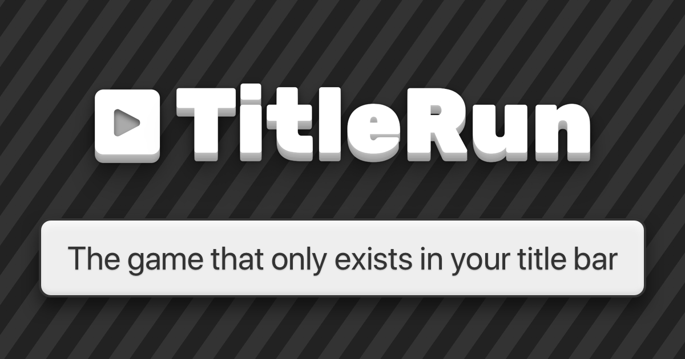

  

  
  
  
  

<h3 align="center">
  <a href="#installation-">Installation</a>
   · 
  <a href="#license">License</a>
</h3>

## Installation

TitleRun is just basic HTML/CSS/JavaScript and works without any dependencies. You can run the game by opening `index.html` in your browser.

Dependencies are only needed if you want the bookmarklet button to work. Run `npm install` and `npm run build` to replace the bookmarklet placeholder in `index.html`.

## License

[MIT](LICENSE)
